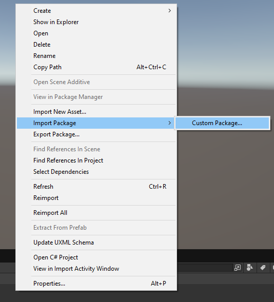
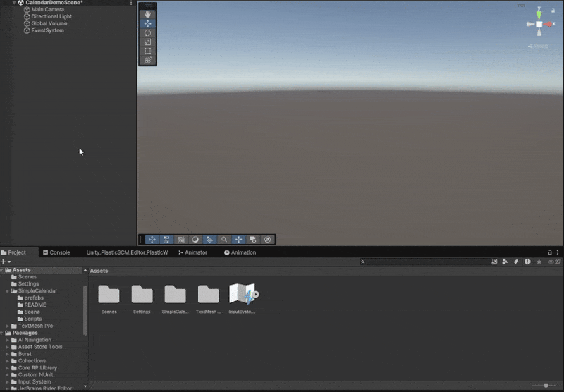
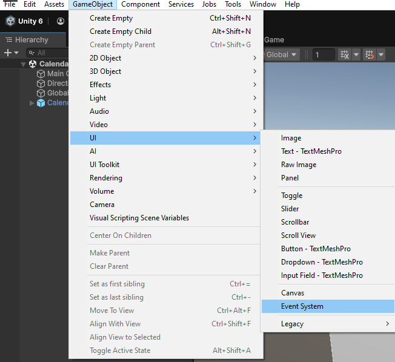
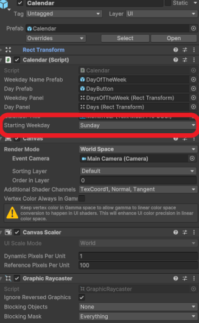
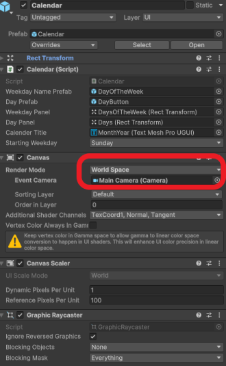
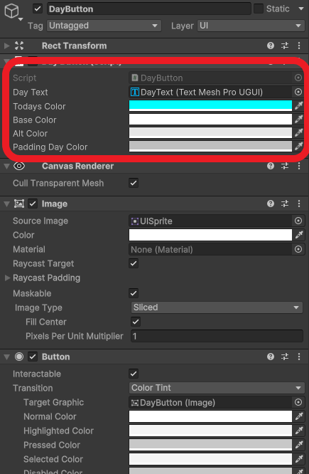

# Simple Calendar

## Table of Contents
- [Introduction](#introduction)
- [Installation](#installation)
- [Customization](#customization)
- [Links](#links)
- [Questions?](#questions)
- [Suggestions?](#suggestions)
- [License](#license)

## Introduction
This is a simple calendar asset for Unity. It is usable in 3D and 2D projects. It is extremely customizable.

## Installation
1. Download the Asset from the Unity asset store or Github
2. Right click an empty spot on your asset browser
3. Import the package 
4. Add the calendar asset to your scene 
5. **IMPORTANT:** If your scene does not have an EventSystem object, add one or the buttons won't work! 

## Customization

### Starting day of the week
If you would like the calendar to start the weeks with mondays or any other day, change the Starting Weekday variable in the Calendar prefab here: 

### 3D world support
To put the calendar in the 3D world and not simply fill the screen, simply install it into a 3d project using the installation instructions above and then change the render mode to world space and move and scale the calendar appropriately. If you want the buttons to still work with mouse input, set the event camera to your user's camera 

Otherwise, keeping it on overlay will simple fill the screen. This can be adjusted to be within other menus for things like daily rewards.

### Changing the look
For the days of the week headers (the words sunday, monday, tuesday, etc that show up on the top of the calendar), you need to adjust the DayOfTheWeek prefab. For the days themselves, you need to adjust the DayButton prefab. The day button prefab's script has variables for the color scheme that you can change in the editor here: 

To customize the rest of the look of the calendar, just change it like any other UI element. You can change colors, fonts, sizes, layout, etc.

## Links
[Unity Asset Store Package](https://assetstore.unity.com/packages/slug/313178)

[Github](https://github.com/ThomasMarascia/SimpleCalendar)

## Questions
If you can't get it to work, you can reach out to me either with my email: marasciagames@gmail.com, asking on the [unity asset store page](https://assetstore.unity.com/packages/slug/313178) or by asking on the [github issue page](https://github.com/ThomasMarascia/SimpleCalendar/issues/new).

## Suggestions
If you have any suggestions for what I should add to make this package better, email me at marasciagames@gmail.com or reach out using the [unity asset store page](https://assetstore.unity.com/packages/slug/313178).

## License
MIT License. Found on Github page
